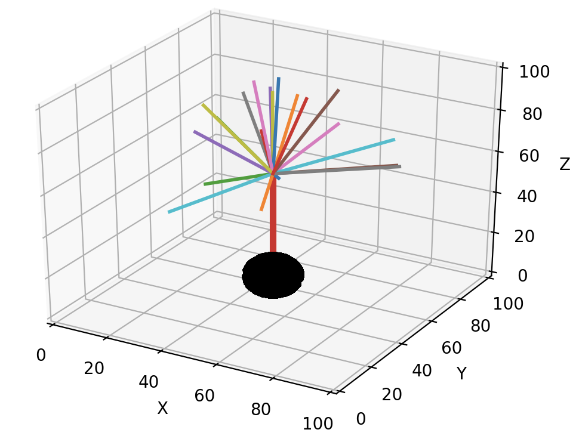
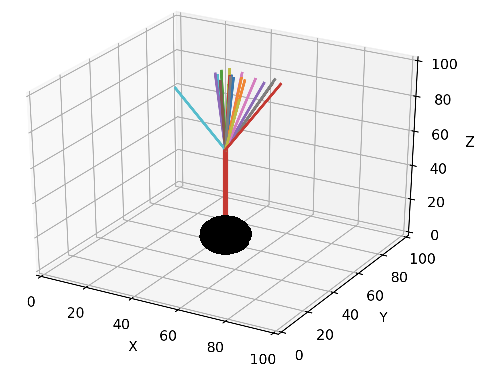
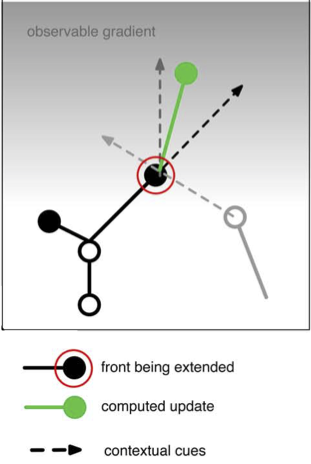
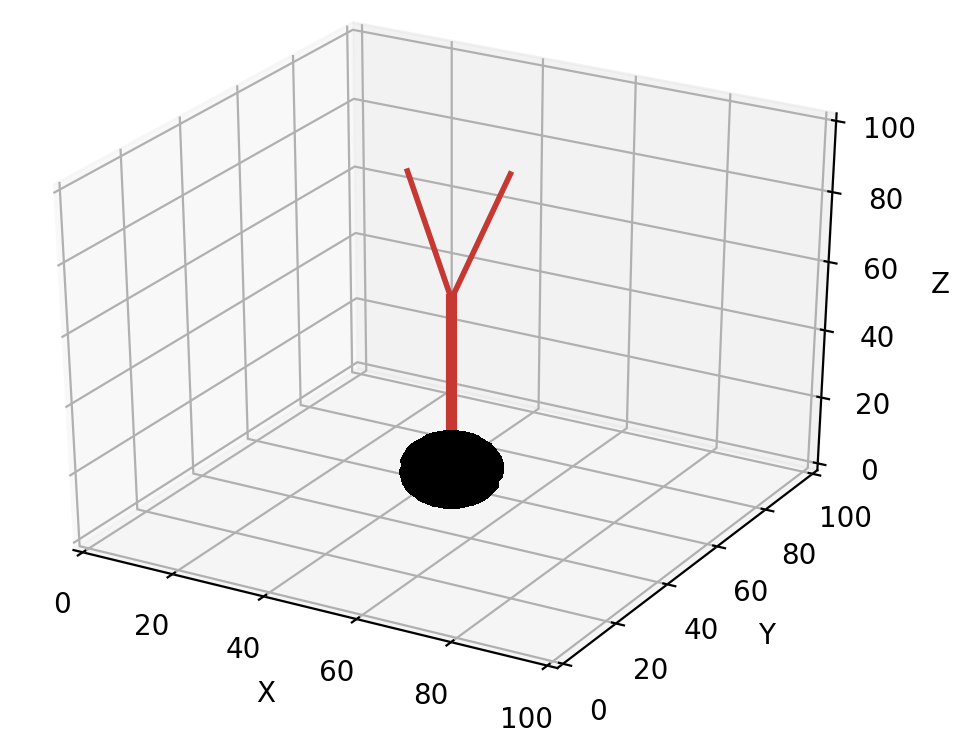

Modeling growth
===============
Growth is simulated in NeuroDevSim by creating new fronts that will become the child of the front calling ``self.manage_front``. This tutorial section focuses on implementing specific kinds of phenomenological growth, it assumes that the reader understands the coding style introduced in :ref:`started-label`.

.. _extension-label:

Front extension
---------------
Front extension is done by the ``add_child`` method. It is the simplest way to grow a neuron. It just requires a coordinate *new_pos* for the new front::

        def manage_front(self,constellation):
            ...
            while count < 100:
                new_dir = ... # do something to get a Point with a new direction
                new_pos = self.end + new_dir # compute position of child end
                # check for possible collisions
                try:
                    new_front = self.add_child(constellation,new_pos) # make a new front
                    # make old front inactive: stops growing -> will not call this method again
                    self.disable(constellation)
                    return # done for this cycle
                except (CollisionError, GridCompetitionError, InsideParentError, VolumeError):
                    count += 1
                    continue # pick another new_pos, no attempt to correct the error

The *new_front* will be a cylinder with ``new_front.orig == self.end`` and ``new_front.end == new_pos``. By default, the new front gets the same *radius*, *branch_name* and *swc_type* values as *self*, but these can easily be changed in the ``add_child`` call::

    new_front = self.add_child(constellation,new_pos,radius=2.,swc_type=2,branch_name="axon1") 

This section deals with successful growth, see :ref:`collisions-label` for more advanced handling of :ref:`collisionerror-label`.  

The art of front extension is determining the new direction for growth. The easiest approach is to use the ``unit_heading_sample`` method that mimics biological growth: growth cones tend to continue along their current path, called heading, with some randomness. The ``unit_heading_sample`` returns a Point vector (relative to [0, 0, 0]) that on average falls within a cone centered around the heading of the current front *self*::

        def manage_front(self,constellation):
            ...
            new_dir = self.unit_heading_sample()
                
The figure below shows different colored directions obtained by 20 calls of ``unit_heading_sample`` for the red front.

The size of the cone can be controlled with the *width* optional parameter, which sets the standard deviation of the Gaussian distribution around zero angle. The default value for *width* is 55 degrees, based on cat spinal cord motor neurons, and often a smaller cone is desirable::

        def manage_front(self,constellation):
            ...
            new_dir = self.unit_heading_sample(width=20)

As implicit in the name, ``unit_heading_sample`` returns a vector that is 1 µm long. Usually one will want to make longer fronts. In general, **fronts should be longer than their radius** to avoid spurious collision errors. A simple multiplication of *new_dir* achieves this goal::  

        def manage_front(self,constellation):
            ...
            new_dir = self.unit_heading_sample(width=20)
            new_pos = self.end + new_dir * 10. # compute position of child end
            
In the figures above, the different front lengths were 40 µm.  

As mentioned in :ref:`fronts-label`, front extension will often be determined by combining several influencing factors. Each of these factors can be represented by a vector and the resulting new direction will be the sum of those vectors. For example, the following code::

    pia = 199 # z coordinate of the pia, an attractive boundary
    ...
        def manage_front(self,constellation):
            ...
            # 1) black arrow: grow in the same direction as self: get the vector direction of self
            heading_dir = (self.end - self.orig).norm() # norm returns unit length vector
            # 2) light grey arrow: repulsed by another neuron: this requires two steps
            #  2a) get a list of positions of all fronts belonging to other nearby neurons, uses the default what="other" option of get_fronts
            other_fronts = self.get_fronts(constellation,max_distance=20.)
            #  2b) get a direction to the nearest front
            if len(other_fronts) > 0:  # safe coding!
                other = other_fronts[0][0] # closest front
                dir_to_other = (other.mid() - self.end).norm() # use mid point on other front
            else:
                dir_to_other = Point(0.,0.,0.)  # no direction
            # 3) dark grey arrow: attracted by a gradient: we use the numerically most efficient solution
            dir_to_pia = Point(0.,0.,pia).norm() # vertical direction
            # now combine by scaling and summing these 3 vectors, repulsion is a subtraction
            new_dir = heading_dir * 2.0  - dir_to_other + dir_to_pia * 2.0
            new_pos = self.end + new_dir  # increment from current positon
            ...

represents the vector addition in the figure below.

.. _tbranching-label:

Terminal branching
------------------
Terminal branching occurs at the growth tips, another form of branching that happens in older parts of the neuron is described in :ref:`ibranching-label`. Terminal branching is in its simplest form very similar to :ref:`extension-label` but more than one front is created::

        def manage_front(self,constellation):
            ...
            points = ...  # generate a list of points for new_front.end
            rad = self.taper(0.8) # decrease radius
            num_branch = 0 # count number of branches
            for p in points: # make 2 branches
                ...
                try:
                    new_front = self.add_child(constellation,p,radius=rad) # make a new front
                    num_branch += 1 # success
                    if num_branch == 2: # enough branches made
                        self.disable(constellation)
                        return # completed this call
                except (CollisionError, GridCompetitionError, InsideParentError, VolumeError):
                    continue # pick another point, no attempt to correct the error
            ...

Note that the radius of the new fronts was decreased by ``0.8 * self.radius`` using the ``taper`` method. The order of the new fronts is automatically increased by one after each branching event.

Directions for the new branches are chosen with a similar procedure as described in :ref:`extension-label` but using the ``unit_branching_sample`` method. ``unit_branching_sample`` returns a given number of directions that have an angle relative to the heading of the calling front (if it is cylinder) and a minimal separation between each possible pair. This results a biological branching pattern, the directions are again obtained from normal distributions based on cat spinal cord motor neurons::

                    points = self.unit_branching_sample(5) # generate more points than needed

An example of default ``unit_branching_sample``:

``unit_branching_sample`` can generate a maximum of 20 separated directions. The mean and width of both the branching angle and the separation angle can be changed by the user, see :ref:`simulator-label`.  

Another requirement is to decide when to branch. The simplest approach is to draw a random number::

        def manage_front(self,constellation):
            ...
            if numpy.random.random() < 0.05:  # branch
                points = self.unit_branching_sample(5)
                ...
            else:  # just extend the front
                new_dir = self.unit_heading_sample(width=20)
                ...

This can be made fancier by making the branching probability order-dependent::

        def manage_front(self,constellation):
            ...
            if self.order > 5:
                bif_prob = 0.03
            else: # minimal order for non-somatic front is 1
                bif_prob = 0.6 / (self.order * 2.)
            if numpy.random.random() < bif_prob:  # branch
                points = self.unit_branching_sample(5)
                ...
            else:  # just extend the front
                new_dir = self.unit_heading_sample(width=20)
                ...

Another approach is to make branching dependent on the environment, for example which cortical layer the front occupies. 

Branch termination
------------------
Growth of a dendritic or axonal branch can be terminated by disabling the front at its tip::

        def manage_front(self,constellation):
            ...
            self.disable(constellation) # make inactive and stop growth
            return

Obviously a decision is required on when to terminate growth. This is usually done based on random numbers::

        def manage_front(self,constellation):
            ...
            if numpy.random.random() < 0.02:  # terminate
                self.disable(constellation) # make inactive and stop growth
                return
                
Another termination condition can be cumulative distance from the soma *path_length*::

        def manage_front(self,constellation):
            ...
            if self.path_length > 500.:  # terminate
                self.disable(constellation) # make inactive and stop growth
                return
                
or use *self.order*, *constellation.cycle*, etc. An unsolvable :ref:`collisionerror-label` may also be a reason to terminate growth.

.. _ibranching-label:

Interstitial branching
----------------------
Interstitial branching is the process where a branch sprouts from a neuron segment that is not a growth cone, this happens more frequently in axons than in dendrites. Simulating interstitial branching is similar to terminal branching but requires careful handling of *active* and *growing* status of the parent front. The first step is to **not** ``disable`` the future parent front after it completes its initial front extension::

        def manage_front(self,constellation):
            ...
            elif self.swc_type == 4: # apical dendrite: can sprout obliques later
                ...
                try:
                    new_front = self.add_child(constellation,new_pos,radius=rad) # make a new front and store it
                    if (self.path_length < 50.): # close to soma, no interstitial growth
                        self.disable(constellation)
                    # other new_front are not disabled
                    return # done for this cycle
                except (CollisionError, GridCompetitionError, InsideParentError, VolumeError):
                ...

In the example code above, taken from the :ref:`interstitialnote-label`, this is done conditionally: only apical dendrite fronts that are some distance from the soma are not disabled.

The interstitial growth itself is handled similarly to front extension but needs to be made a rare event as it should happen for only a few fronts::

        def manage_front(self,constellation):
            ...
            elif self.swc_type == 4: # apical dendrite: can sprout obliques later
                ...
                if np.random.random() < 0.0025: # make oblique dendrite
                    ...
                    try:
                        new_front = self.add_child(constellation,new_pos,radius=rad,swc_type=8)
                        self.disable(constellation) # stop interstitial growth
                        return # done for this cycle
                    except (CollisionError, GridCompetitionError, InsideParentError, VolumeError):
                    ...

Obviously the code needs to distinguish between front extension and interstitial growth, this can be done by tracking *self.num_children*::

        def manage_front(self,constellation):
            ...
            elif self.swc_type == 4: # apical dendrite: can sprout obliques later
                if self.num_children == 0: # initial extension of apical dendrite
                    # front extension code
                    ...
                else:
                    # interstitial branching code
                    ...
                    
It is easy to generate a growth direction for the oblique dendrite that is close to perpendicular to the apical one by requesting a mean angle of 90 degrees for ``unit_heading_sample``::

        rnd_dir = self.unit_heading_sample(mean=90,width=10) # close to perpendicular
        new_pos = self.end + rnd_dir * 4.0

It may also be desirable to prevent sprouting of additional oblique dendrites within a given distance of the new one::

        def manage_front(self,constellation):
            ...
            elif self.swc_type == 4: # apical dendrite: can sprout obliques later
                ...
                if np.random.random() < 0.0025: # make oblique dendrite
                    ...
                    rnd_dir = self.unit_heading_sample(mean=90,width=10) # close to perpendicular
                    new_pos = self.end + rnd_dir * 4.0
                    try:
                        new_front = self.add_child(constellation,new_pos,radius=rad,swc_type=8) # make a new front and store it
                        self.disable(constellation) # stop interstitial growth
                         # stop interstitial branching within 10 µm distance
                        neighbors = self.get_neighbors(constellation,10.,branch_stop=True)
                        for front in neighbors:
                            if front.is_active():
                                front.disable(constellation) # stop interstitial growth
                        return # done for this cycle
                    except (CollisionError, GridCompetitionError, InsideParentError, VolumeError):

``get_neighbors`` will return a list of fronts that is within a 10 µm path_length distance of self, in both somatopetal and somatofugal directions.

Finally, if oblique growth should occur only at much later developmental stages, it is more efficient to ``disable`` the future parent till the cycle in which oblique growth can start::

        def manage_front(self,constellation):
            ...
            elif self.swc_type == 4: # apical dendrite: can sprout obliques later
                ...
                try:
                    new_front = self.add_child(constellation,new_pos,radius=rad) # make a new front and store it
                    if (self.path_length < 50.): # close to soma, only extension
                        self.disable(constellation) # no interstitial growth
                    else:
                        self.disable(constellation,till_cycle_g=100) # delayed interstitial growth
                    return # done for this cycle
                except (CollisionError, GridCompetitionError, InsideParentError, VolumeError):
                ...

The *till_cycle_g* optional parameter disables till the given cycle, at which time the front is made *active* again and set to *growing*. Similar code can be used to interrupt any type of growth.
