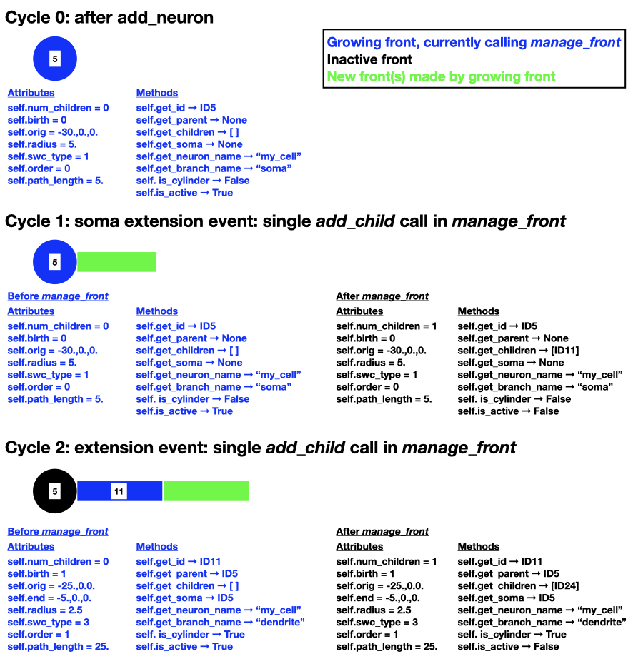
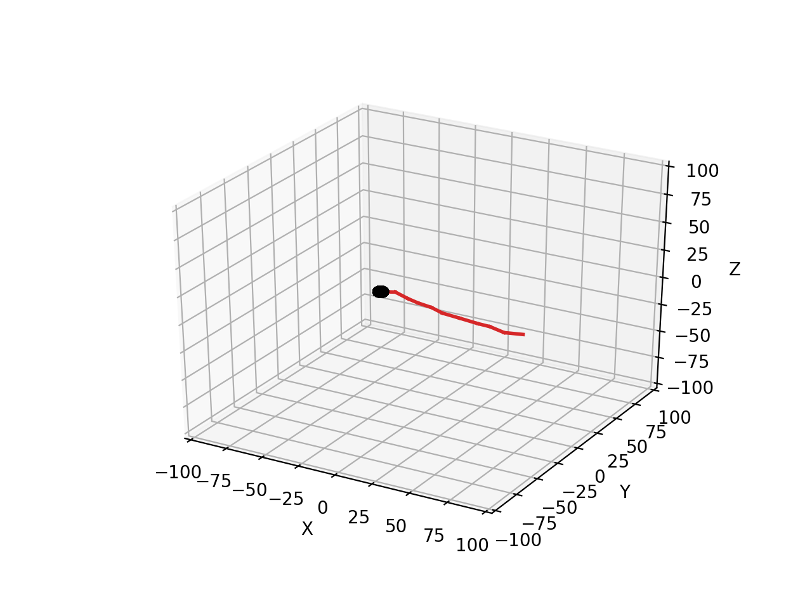
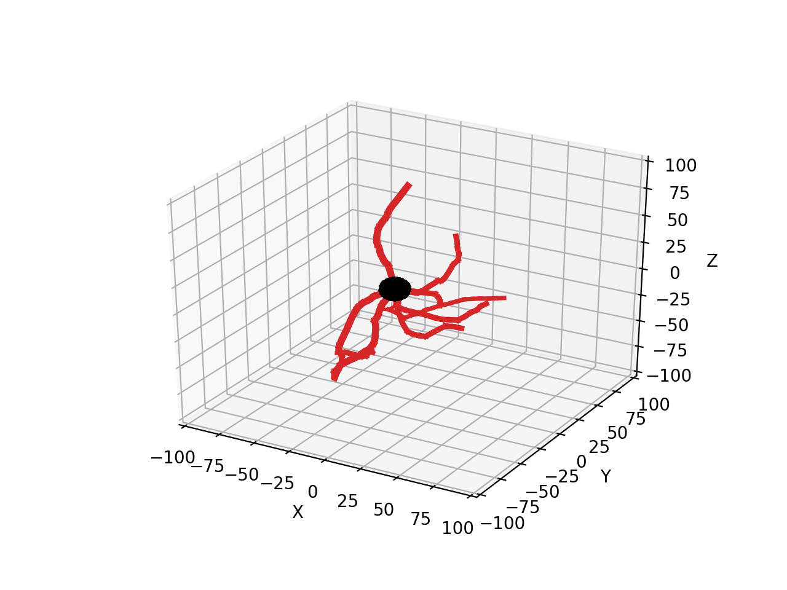
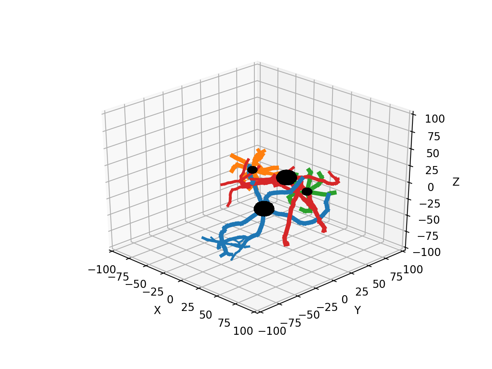
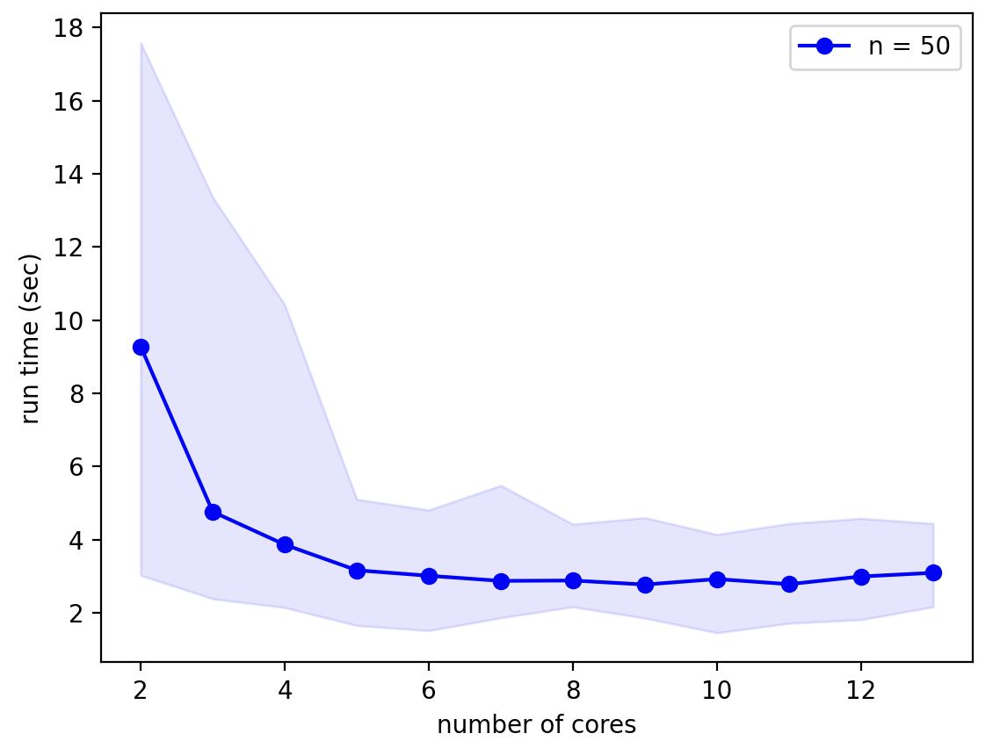
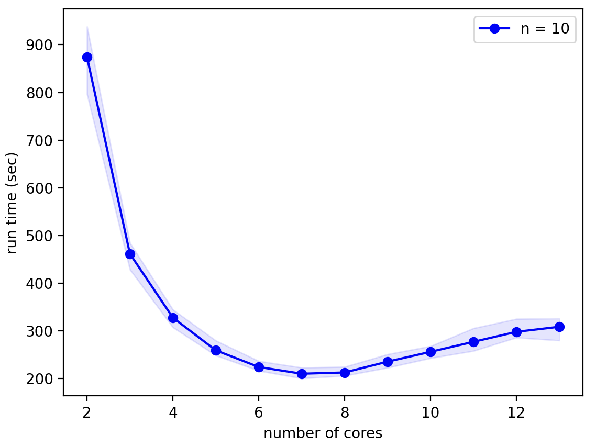

.. _started-label:

Getting started
===============

Model introduction
------------------

NeuroDevSim uses an agent-based approach to modeling neural development, with ``Front`` objects as agents that can extend, branch, migrate, etc.

Each NeuroDevSim model is described by a complete python program. Part of this program follows a standard template, specific model properties are minimally defined in three methods:

1. A method describing the behavior of a ``Front``: ``manage_front`` which is part of a new subclass of :ref:`front-label` defined for each type of neuron.

2. The simulation volume that is specified in the :ref:`admin_agent-label` instantiation. ``Admin_agent`` takes care of running the simulation.

3. Create a number of somata, each becomes the root of a growing neuron: use the ``Admin_agent.add_neurons`` method.

Model template
--------------
The general template of a simple model is::

    # STANDARD: import all classes, methods and functions needed
    from neurodevsim.simulator import *

    # declare a subclass of Front
    class MyFront(Front):

        # declare a customized growth method for the new subclass
        def manage_front(self,constellation):
            ...

    # STANDARD: initialize and run the simulation
    if __name__ == '__main__':

        # declare parameters for Admin_agent
        num_processes = 4
        fname = "filename.db"
        sim_volume = [[0., 0., 0.], [100., 100., 100.]]
        neuron_types = [MyFront]

        # instantiate Admin_agent
        admin = Admin_agent(num_processes,fname,sim_volume,neuron_types)

        # declare parameters for add_neurons
        name = "a_neuron"
        num_neurons = 1
        location = [50.0,50.0,50.0]
        radius = 5.0

        # make a soma and set the neuron name
        admin.add_neurons(MyFront,name,num_neurons,location,radius):

        # STANDARD: run the simulation
        admin.simulation_loop(50)

        # STANDARD: clean up before quitting
        admin.destruction()

We explain each part of the template briefly. Full descriptions of the classes and methods can be found in :ref:`simulator-label`, while the :ref:`manage_front-label` is explained in more detail later.

First import the different NeuroMaC support functions and classes::

    from neurodevsim.simulator import *

Everything needed to run the simulation is imported at once from the *neurodevsim.simulator* module. There is an additional *neurodevsim.processing* module that has functions to :ref:`plots-label` and make movies from the simulation database. If random numbers are needed `NumPy <http://www.numpy.org/>`_ should also be imported.

The model will simulate the behavior of growing neurons, with most of the growth processes encapsulated in fronts. First define **for each different type of neuron** in the model a new subclass derived from ``Front``::

    class MyFront(Front):

The name, *MyFront*, can be chosen freely. The rest of the statement is fixed.

An essential part of the new class definition is the ``manage_front`` method::

    class MyFront(Front):

        def manage_front(self,constellation):

``manage_front`` defines the growth, migration etc. behavior of the neuron model and is explained in detail in :ref:`manage_front-label`.

After defining all the neuron classes, the main program is started::

    if __name__=="__main__":

This statement should never be changed.

The first parts of the main part of the program initialize different structures needed for a NeuroDevSim simulation. Begin with instantiating an :ref:`admin_agent-label`, for clarity its parameters are defined first::

    if __name__ == '__main__':

        # declare parameters for Admin_agent
        num_processes = 4
        fname = "filename.db"
        sim_volume = [[0., 0., 0.], [100., 100., 100.]]
        neuron_types = [MyFront]

        # instantiate Admin_agent
        admin = Admin_agent(num_processes,fname,sim_volume,neuron_types)

*Admin_agent* controls the overall simulation and manages the parallel processing using different cores.

In this example 5 cores will used: one to run *Admin_agent* and 4 processes (*num_processes*) that compute the simulation.

*Admin_agent* also generates the model output, which is written to a sqlite database file with the user provided *fname* 'filename.db'. All NeuroDevSim databases use the '.db' suffix, it will be added if not provided. Most users do not need to worry about the structure or content of the database, but information is available in :ref:`database-label`. Figures and movies can be produced with ``nds_plot`` or ``nds_movie`` respectively and other analysis routines are also available (:ref:`processing-label`).

NeuroDevSim simulations run in a rectangular volume with boundaries defined in *sim_volume*. These are defined as list of [*x*, *y*, *z*] coordinates in µm with *x* representing width, *y* depth and *z* height. The first list is therefore the left-front-bottom coordinate and the second list is the right-back-top coordinate. Coordinates can be negative.

The final obligatory parameter to *Admin_agent* is a list of all ``Front`` subclass names that will be used in the simulation in *neuron_types*. These need to be declared in advance to allow for proper set-up of the shared memory.

Other optional parameters to *Admin_agent* can set the level of verbosity, set the random seed or activate and control interactive plots.

Now that *Admin_agent* is up and running, neurons can be added to the simulation. Each neuron in NeuroDevSim has to be declared and this results in the placement of a soma in the simulation volume. This soma will be the root of a growing tree.

The ``Admin_agent.add_neurons`` method is used to create somata::

        # declare parameters for add_neurons
        name = "a_neuron"
        num_neurons = 1
        location = [50.0,50.0,50.0]
        radius = 5.0

        # make a soma and set the neuron name
        admin.add_neurons(MyFront,name,num_neurons,location,radius)

In the example above only a single neuron is created. The parameters are respectively: the neuron ``Front`` subclass (that has been declared in *neuron_types* for ``Admin_agent``), a name for the neuron (maximum 34 characters long), number of neurons to be created, location of the neuron somata and radius of the soma.

The *add_neurons* call above creates a single instance of *MyFront* named *a_neuron_0_* with a soma of radius 5 µm at the location [50,50,50]. When multiple neurons are created, the location becomes a list defining a bounding box: [left,front,bottom] to [right,back,top]. The following example randomly distributes 10 soma instances of *MyFront* within a layer at the bottom of the simulation volume, somata are separated by at least their diameter::

        # make a soma and set the neuron name
        admin.add_neurons(MyFront,name,10,[[20,20,5],[80,80,10]],radius)

The neurons will be numbered consecutively: *a_neuron_0_*, *a_neuron_1_*,... Instead of random placement, somata can also be placed on a grid by providing an optional *grid* parameter or their *origins* can be specified as a list. *add_neurons* can be called repeatedly to create complex distributions of soma locations or to mix different neuron classes in the simulation as will be shown in :ref:`smallnetwork-label`.

Now the initialization is complete and the simulation can be run::

        admin.simulation_loop(50)

One needs to specify the number of simulation cycles, i.e. number of growth events for each neuron, to be simulated. It is 50 in the example above. *simulation_loop* can be called repeatedly so that model settings can be changed in between.

When the simulation is complete, it should be cleaned up properly::

        admin.destruction()

This is important because the simulation is multi-process: all running python processes need to be terminated explicitly.

Running the examples
--------------------
There are two ways to run a NeuroDevSim simulation, including the examples:

1. Using `jupyter notebook <http://jupyter.org/>`_. This is the preferred method for the :ref:`examplesnote-label`, which are all available as notebooks in the examples directory.
2. Run it as python program in a `terminal <https://en.wikipedia.org/wiki/List_of_terminal_emulators>`_ window. This is more convenient if a large number of simulations needs to be performed or if large models are simulated.

There is no significant difference in run-time between either approach for an *Admin_agent* ``verbose=0`` setting.

**Notebooks** can also provide active 3D plots that are generated during the simulation. One turns on plotting during the *Admin_agent* instantiation::

    ...
    # STANDARD: initialize and run the simulation
    if __name__ == '__main__':

        ...
        # instantiate Admin_agent with plot=True
        admin = Admin_agent(num_processes,fname,sim_volume,neuron_types,plot=True)

When the simulation is finished the 3D plot can be rotated, zoomed in/out, etc. To draw the notebook plot an extra core is used, so the total cores used to run the simulation becomes ``num_processes + 2``. Note that even with the extra core drawing plots makes simulations run significantly slower: the motor_neuron example in :ref:`realnote-label` runs 10-30 times slower depending on hardware. Similarly, the text output generated with the default ``verbose=1`` *Admin_agent* setting makes this example run ~20% slower.

.. warning:: if a notebook simulation crashes the python, processes on *num_processes* cores may still be running, shown by the filled circle top right in the notebook window. Use the **restart the kernel** button (the circular arrow) at the top of the notebook window to kill these processes.

To run a simulation in a **terminal** window the code should be saved in a file, e.g. *myfront.py*, and run as a python process::

    python myfront.py

Use the functions in the *processing module* to analyze the simulation results, for example by plotting to a pdf file and making a movie::

    from neurodevsim.processing import *

    # generate a pdf file 'myfront.pdf' from the NeuroDevSim database 'myfront.db'
    nds_plot('myfront.db')
    # generate a movie 'myfront.mp4' from the NeuroDevSim database 'myfront.db'
    nds_movie('myfront.db')

Neurons as a tree
-----------------
Before delving deeper into  coding for growth, the properties of fronts will be explained in more detail. :ref:`agent-label` was introduced previously. Fronts act as agents, which means in practice that each active front calls the ``manage_front`` method separately and during this call it is referred to as *self*.

Fronts have several attributes that decide on their position and role, properties related to their place in the tree hierarchy are mostly accessed by methods:

**Public read-only attributes:**

- *self.orig*: a ``Point`` as coordinate, specifying the origin of a cylinder or center of a sphere.
- *self.end*: a ``Point`` as coordinate, specifying the end of a cylinder.
- *self.radius*: the radius of the front in µm.
- *self.path_length*: distance in µm to soma center along the tree structure.
- *self.num_children*: number of children of the front in the tree structure.
- *self.birth*: simulation cycle when the front was created.
- *self.order*: centripetal order of branching in the tree structure, soma has order 0.
- *self.swc_type*: a code describing which part of the neuron is represented as defined in `Cannon et al. 1998 <https://www.ncbi.nlm.nih.gov/pubmed/9821633>`_, see :ref:`swc-label`.

**Important methods:**

- *self.get_id()*: returns the ``ID`` of *self*, the ``ID`` is a unique identifier for each front.
- *self.is_cylinder()*: returns True if front is a cylinder, False if it is a sphere.
- *self.get_parent(constellation)*: returns the parent of *self*.
- *self.get_children(constellation)*: returns a list of all children of *self*.
- *self.get_soma(constellation)*: returns the soma of the neuron *self* belongs to.
- *self.get_neuron(constellation)*: returns the ``Neuron`` *self* belongs to.
- *self.get_neuron_name(constellation)*: returns the name of the neuron *self* belongs to.
- *self.get_branch_name()*: returns the optional branch name of *self*.

Many more methods are available, see  :ref:`simulator-label`. The ``get_parent``, ``get_children`` and ``get_soma`` methods return by default a ``Front`` or list of ``Front``, but with the optional parameter ``returnID=True`` they will return an ``ID`` or list of ``ID`` instead. They can in addition print the information. 

To illustrate how these attributes and methods reflect a real growing neuron they are shown for the example that was introduced previously in :ref:`agent-label`. Note that the numbers on the fronts symbolize their ``ID``, but real ``ID`` are more complex.

.. _manage_front-label:

``manage_front`` method
-----------------------
The ``manage_front`` method specifies all of the model specific growth, migration, etc. rules that act on ``Front``.

A very simple case will be described, based on the ``RandomFront`` subclass in  :ref:`errorsnote-label` and :ref:`randomnote-label`. *manage_front* takes 1 argument::

    class RandomFront(Front):
        def manage_front(self, constellation):

``manage_front`` is called by every active ``RandomFront`` at every simulation cycle. The calling front is *self*. The argument is the :ref:`constellation-label`, a complex data structure that contains information about all other fronts and substrates in the simulation and provides a few methods. The *constellation* is not used directly, it is passed to other NeuroDevSim methods.

Basic growth
++++++++++++

We'll start with a very simple example: growth of a single branch from the soma::

    class RandomFront(Front):
        def manage_front(self,constellation):
            if self.path_length < 100: # continue growth till close to border of simulation volume
                # extend towards right with a bit of noise
                new_pos = self.end + Point(10.,0.,0.) +  unit_sample_on_sphere() * 3.0
                new_front = self.add_child(constellation,new_pos,radius=1.) # make a new front
            self.disable(constellation) # make calling front inactive: stops growing
            
This code will produce a single slightly wiggling red branch connected to the black soma: 

Let's look at each line of the code. The first line restricts the total length of the branch so that it stays within the simulation volume::

            if self.path_length < 100: # continue growth till close to border of simulation volume

only if the current front has a *path_length* shorter than 100 µm will it make a child to extend the branch. If this is the case then the end position *new_pos* of the new child front has to be computed::

                new_pos = self.end + Point(10.,0.,0.) +  unit_sample_on_sphere() * 3.0
                
*new_pos* is computed relative to the end point *self.end* of the calling cylindrical front. Growth is to the right: the ``Point`` structure generates in this case a *x*, *y*, *z* vector with length 10 µm pointing towards the right (positive *x*). Finally a bit of noise is added: ``unit_sample_on_sphere()`` returns a ``Point`` representing a 1 µm long vector in a random direction and this is multiplied to make it a 3 µm long vector. Therefore, depending on the noise, the new_front will be 7 - 13 µm long. To avoid spurious errors it is best to make sure that new fronts are longer than their radius.

Simple arithmetic operations with ``Point`` are supported, with the simple rule that for any such operation the first variable always should be a ``Point``. This means that one can compute ``a_point * 15`` but not ``15 * a_point``. In the code above, first two ``Point`` are added together, resulting in a new ``Point``. Then the last ``Point`` is multiplied by 3, which results in another new ``Point`` that is added to the previous one to generate the result.

With *new_pos* a new front can be generated with the ``add_child`` method::

                new_front = self.add_child(constellation,new_pos,radius=1.) # make a new front
                
``add_child`` is the most common used growth method: it will immediately make the new front or generate an error (see further). In this simple example only a few parameters are provided to ``add_child``: obigatory parameters *constellation* and *new_pos* and the optional parameter *radius*. Most ``Front`` method calls require *constellation* to be passed. *new_pos* was computed on the previous line and *radius* is required to change from the soma radius of 5 µm to 1 µm for the dendrite.

Slightly more complex code could check whether ``add_child`` is called by a front different from the soma, and then *radius* no longer needs to be specified because it is automatically inherited from *self*. Similarly, the *swc_type* of *new_front* has automatically been switched from 1 for the soma to 3 for dendrites and is then inherited and its *order* was automatically increased from 0 for the soma to 1. Finally, ``self.num_children`` was increased from 0 to 1.

``add_child`` returns the new front that was made. In a more advanced coding context this can be useful. Only *self* may call ``add_child`` in a ``self.manage_front`` method call.

The final line of code is less intuitive but very important: once *self* has made a child it never should be called again because with the current code it would then try to make a second, third etc. child. This is achieved by the ``disable`` method that again takes *constellation* as obligatory parameter::

            self.disable(constellation) # make calling front inactive: stops growing

``disable`` makes the front inactive: its ``manage_front`` method is never called again. As was shown in the figure in :ref:`agent-label` the normal sequence of front activity during growth is: 

- a new front made by ``Admin_agent.add_neurons`` or ``Front.add_child`` is active.
- its ``manage_front`` method will be called on the next cycle.
- if its growth is successful it is usually made inactive to prevent further growth.

Basic error catching
++++++++++++++++++++
Error catching is an essential programming technique in NeuroDevSim models, the basic approach is introduced here. A more detailed description is given in the :ref:`errorsnote-label`.

Every ``Front`` method that can cause solvable errors should be embedded in a ``try:`` statement followed by an ``except:`` statement (see `Python Errors and Exceptions <https://docs.python.org/3/tutorial/errors.html>`_). For ``add_child`` in the above example this becomes::

            try:
                new_front = self.add_child(constellation,new_pos,radius=1.) # make a new front
                # optionally execute other code if new front was made
            except:
                # no new front was made
                print("Unexpected error:", sys.exc_info()[0])

If ``add_child`` is successful the ``except:`` statement is ignored, but if an error occurred the ``except:`` will be executed and the error will be printed and then the simulation will continue. In the absence of ``try:`` and ``except:`` a similar error will cause the simulation to crash with a Traceback and an Error statement. 

This approach is useful because in a real simulation some errors, like the collision of a new front with an existing one (:ref:`collisionerror-label`) or an attempt to grow out of the simulation volume (:ref:`volumeerror-label`), are expected. The ``except:`` statement can be made more specific to  handle only such expected errors::

            try:
                new_front = self.add_child(constellation,new_pos,radius=1.) # make a new front
                # optionally execute other code if new front was made
            except (CollisionError,GridCompetitionError,InsideParentError,VolumeError) as error:
                # no new front was made
                print("cycle",constellation.cycle,":",error)

These error types will be explained in :ref:`usefulerrors-label`. If another type of error occurs, like a ``BugError`` the simulation will still crash appropriately. Obviously, just printing the error is not very useful though for the extremely simple model simulated here nothing more can be done. In the next subsection a more complex model will be examined where the ``except:`` statements are used to try to overcome the error.

.. _randomf-label:

More advanced growth
++++++++++++++++++++
Next we'll simulate a simple branching neuron looking like (each simulation will be different):

    
The code for this example can be found in the :ref:`randomnote-label`.

To simulate this effectively, different growth rules apply for the soma compared to other fronts. Therefore, the overall structure of this ``manage_front`` method is::

    def manage_front(self,constellation):
        if self.order == 0: # self is the soma
            # grow multiple branches
            ...
        elif self.path_length < 150: # self is a dendrite front
            # extend or branch this front
            ...
        else: # self is a dendrite front
            # this front stops growing
            ...

The if statement is True only once, during the first simulation cycle when the neuron consists of a soma only. This condition is triggered by::

    if self.order == 0:

Only a soma has *self.order* zero, order is increased automatically for each front sprouting from the soma and after each branch point. An alternative is to test for swc type, which is 1 for a soma: ``if self.swc_type == 1``.

In most models one or more dendrites will sprout from the soma, each of these dendrites starts as a single new ``RandomFront``. In this example 5 fronts, each presenting the root of a dendrite, are made. First generate a number of random directions for growth of these dendrite roots::

        if self.order == 0: # soma: make 5 dendrite roots
            points = self.unit_branching_sample(10) # generate more points than needed

``self.unit_branching_sample`` returns a list of 1 µm directions that are well separated from each other. Note that 10 directions, more than the 5 needed, are generated. This is a simple way to solve errors: the code keeps trying till 5 dendrites are made::

        if self.order == 0: # soma: make 5 dendrite roots
            points = self.unit_branching_sample(10) # generate more points than needed
            num_dend = 0 # count number of dendrites
            for p in points: # make 5 dendrites
                ...
                try:
                    ...
                    num_dend += 1 # success
                    if num_dend == 5: # enough dendrites made
                        ...
                        return # completed this call
                except (CollisionError, GridCompetitionError, InsideParentError, VolumeError):
                    continue # pick another point, no attempt to correct the error
            ...
            
The complete code for somatic growth includes the ``add_child`` and ``disable`` methods that are used like in the code for the simple unbranching dendrite::

        if self.order == 0: # soma: make 5 dendrite roots
            points = self.unit_branching_sample(10) # generate more points than needed
            num_dend = 0 # count number of dendrites
            for p in points: # make 5 dendrites
                new_pos = self.orig + p * 15. # compute position of dendrite end
                # check for possible collisions
                try:
                    new_front = self.add_child(constellation,new_pos,radius=2.) # make a new front
                    num_dend += 1
                    if num_dend == 5: # enough dendrites made
                        # make soma inactive: stops growing -> will not call this method again
                        self.disable(constellation)
                        return # completed this call
                except (CollisionError, GridCompetitionError, InsideParentError, VolumeError):
                    continue # pick another point, no attempt to correct the error
            print ("Warning: less than 5 dendrites made for",self.get_neuron_name(constellation),num_dend)
            # make soma inactive: stops growing -> will not call this method again
            self.disable(constellation)
            
Note that *new_pos* is 15 µm away from the soma center *self.orig*. For fronts connecting to a spherical front, like the soma, it is important to ensure that the *new_front.end* coordinate falls outside the sphere otherwise an ``InsideParentError`` will occur. *new_front.orig* will automatically be placed on the surface of the soma sphere where the direction specified intersects it. ``new_front.length()`` will be 10 µm: ``new_pos.length() - self.radius``.

If 10 directions was not sufficient and less than 5 dendrites were made a warning is printed. Note that because ``if num_dend == 5:`` was never True, the ``self.disable(constellation)`` statement never got executed so this needs to be done now.

The next part of the code governs growth of the dendrite provided the current branch is less than 150 µm long. It decides whether to continue current growth or rarely branch::

        elif self.path_length < 150: # continue growth of a dendrite or branch it
            if np.random.random() > 0.06: # most probable: extend with a single front
                ...
            else: # branch with low probability
                ...

In this model the branching probability is 6%, the branching decision is made using the ``numpy`` library to generate a uniform random number between 0 and 1.  

Front extension again needs to deal with :ref:`collisionerror-label` etc. Here a very simple approach is used: a semi-random direction for extension is computed with the ``self.unit_heading_sample`` method and this direction is used to try to make a front 5 µm long. If this fails another semi-random direction is tried, till ``add_child`` succeeds::

        elif self.path_length < 150: # continue growth of a dendrite or branch it
            if np.random.random() > 0.06: # most probable: extend with a single front
                count = 0 # counts number of add_child trials
                while count < 100:
                    extension = self.unit_heading_sample(width=20)
                    ...
                    # check for possible collisions
                    try:
                        ...
                        # success
                        return # done for this cycle
                    except (CollisionError, GridCompetitionError, InsideParentError, VolumeError):
                        # failed
                        count += 1
                        continue # pick another new_pos, no attempt to correct the error

This is tried up to a 100 times, but usually only a few trials are needed. The *count* is incremented only if an error occurred, otherwise the ``while`` loop is left with the ``return`` statement.

``self.unit_heading_sample(width=20)`` returns a ``Point`` representing a 1 µm direction vector, drawn from a normal distribution centered around the direction vector of *self* with a standard deviation of 20. As a result, the dendrite will grow in roughly the same direction as *self*. A biologically unrealistic abrupt change of direction could occur if a truly random direction was used, as generated with ``unit_sample_on_sphere()``.

The complete code for front extension is::

        elif self.path_length < 150: # continue growth of a dendrite or branch it
            if np.random.random() > 0.06: # most probable: extend with a single front
                count = 0 # counts number of add_child trials
                while count < 100:
                    extension = self.unit_heading_sample(width=20)
                    new_pos = self.end + extension * 5. # compute position of child end
                    # check for possible collisions
                    try:
                        new_front = self.add_child(constellation,new_pos) # make a new front and store it
                        # make front inactive: stops growing -> will not call this method again
                        self.disable(constellation)
                        return # done for this cycle
                    except (CollisionError, GridCompetitionError, InsideParentError, VolumeError):
                        count += 1
                        continue # pick another new_pos, no attempt to correct the error
                print ("Warning: failed extension for dendrite of",self.get_neuron_name(constellation))
                if (constellation.cycle - self.birth) > 2: # this was second failed attempt:
                    self.disable(constellation) # stop trying

Differences with the code for the soma are that because a cylindrical front is extended with another cylindrical front, *new_pos* is now computed relative to *self.end* and therefore the true length of the new front is specified: 5 µm. *new_front.orig* will be equal to *self.end* and *new_front.end* to *new_pos*. No *radius* is specified in ``add_child`` because it stays identical to *self.radius*. 

Finally, the end of the code deals with the unlikely case that no new front was made (``count == 100``). Similar to the soma branching case a warning is printed, but the disabling of *self* is handled differently. *self* is only disabled if extension failed in two consecutive cycles, so after 200 trials in total. To check for this a public attribute of *constellation* is used: *constellation.cycle* which is the current simulation cycle. This is compared with the cycle during which *self* was created, stored in *self.birth*.

The code for branching is quite similar to that for soma branching::

            else: # branch with low probability
                points = self.unit_branching_sample(5) # generate more points than needed
                rad = self.taper(0.8) # decrease radius
                num_dend = 0 # count number of dendrite branches
                for p in points: # make 2 branches
                    new_pos = self.end + p * 5.  # compute position of child end
                    # check for possible collisions
                    try:
                        new_front = self.add_child(constellation,new_pos,radius=rad) # make a new front and store it
                        num_dend += 1
                        if num_dend == 2: # enough dendrites made
                            # make front inactive: stops growing -> will not call this method again
                            self.disable(constellation)
                            return # done for this cycle
                    except (CollisionError, GridCompetitionError, InsideParentError, VolumeError):
                        continue # pick another new_pos, no attempt to correct the error
                print ("Warning: failed branching for",self.get_neuron_name(constellation),self.num_children)
                if self.num_children > 0: # single child made -> make front inactive
                    self.disable(constellation)

Differences with the soma branching are: only two branches are made (their *order* is increased again) and they also do not have a completely random direction because for cylindrical *self* ``self.unit_branching_sample`` draws directions at a default angle of 45 ± 33 degrees relative to the direction of *self*.  The *radius* of the branch fronts is decreased by 20% relative to that of *self* using ``self.taper(0.8)``. *new_pos* is computed for cylindrical fronts with the real length, as explained for front extension.

This part of the code can fail in two different ways: not a single dendrite was made due to errors or one instead of two dendrites was made. In the first case ``self.num_children == 0`` and *self* is not disabled. In the next cycle it will try to grow again and mostly try extension instead of branching. If a single child was made, ``self.num_children == 1``, *self* is disabled after an extension at a sharp angle. If this happens a lot it would be best to generate more than 5 points with ``self.unit_branching_sample``.

Finally, the code to stop growth ``if self.path_length >= 150`` is very simple::

        else: # reached maximum length -> terminate growth
            self.disable(constellation)

The complete example
--------------------
The complete code to run *RandomFront*::

    from neurodevsim.simulator import *
    import numpy as np

    class RandomFront(Front):
        
        def manage_front(self,constellation):
            if self.order == 0: # soma: make 5 dendrite roots
                points = self.unit_branching_sample(10) # generate more points than needed
                num_dend = 0 # count number of dendrites
                for p in points: # make 5 dendrites
                    new_pos = self.orig + p * 15. # compute position of dendrite end
                    # check for possible collisions
                    try:
                        new_front = self.add_child(constellation,new_pos,radius=2.) # make a new front
                        num_dend += 1
                        if num_dend == 5: # enough dendrites made
                            # make soma inactive: stops growing -> will not call this method again
                            self.disable(constellation)
                            return # completed this call
                    except (CollisionError, GridCompetitionError, InsideParentError, VolumeError):
                        continue # pick another point, no attempt to correct the error
                print ("Warning: less than 5 dendrites made for",self.get_neuron_name(constellation),num_dend)
                # make soma inactive: stops growing -> will not call this method again
                self.disable(constellation)
                
            elif self.path_length < 150: # continue growth of a dendrite or branch it
                if np.random.random() > 0.06: # most probable: extend with a single front
                    count = 0 # counts number of add_child trials
                    while count < 100:
                        extension = self.unit_heading_sample(width=20)
                        new_pos = self.end + extension * 5. # compute position of child end
                        # check for possible collisions
                        try:
                            new_front = self.add_child(constellation,new_pos) # make a new front
                            # make front inactive: stops growing -> will not call this method again
                            self.disable(constellation)
                            return # done for this cycle
                        except (CollisionError, GridCompetitionError, InsideParentError, VolumeError):
                            count += 1
                            continue # pick another new_pos, no attempt to correct the error
                    print ("Warning: failed extension for dendrite of",self.get_neuron_name(constellation))
                    if (constellation.cycle - self.birth) > 2: # this was second failed attempt:
                        self.disable(constellation) # stop trying
                else: # branch with low probability
                    points = self.unit_branching_sample(5) # generate more points than needed
                    rad = self.taper(0.8) # decrease radius
                    num_dend = 0 # count number of dendrite branches
                    for p in points: # make 2 branches
                        new_pos = self.end + p * 5.  # compute position of child end
                        # check for possible collisions
                        try:
                            new_front = self.add_child(constellation,new_pos,radius=rad) # make a new front
                            num_dend += 1
                            if num_dend == 2: # enough dendrites made
                                # make front inactive: stops growing -> will not call this method again
                                self.disable(constellation)
                                return # done for this cycle
                        except (CollisionError, GridCompetitionError, InsideParentError, VolumeError):
                            continue # pick another new_pos, no attempt to correct the error
                    print ("Warning: failed branching for",self.get_neuron_name(constellation),self.num_children)
                    if self.num_children > 0: # single child made -> make front inactive
                        self.disable(constellation)
                        
            else: # reached maximum length -> terminate growth
                self.disable(constellation)

    if __name__ == '__main__':

        # initialize Admin_agent
        fname = "output/random.db"
        sim_volume = [[-100., -100., -100.], [100.0,100.0,100.0]]
        neuron_types = [RandomFront]
        admin = Admin_agent(2,fname,sim_volume,neuron_types,verbose=1,plot=True)

        # make soma and set neuron name
        admin.add_neurons(RandomFront,"rand_neuron",1,[[-30,-30,-30],[30,30,30]],10.)
        # run the simulation
        admin.simulation_loop(25)

        # clean up
        admin.destruction()
    
If you haven't done so yet, open the :ref:`randomnote-label` in the 'examples' directory and run the above code in 'Random_model' twice: for each run the result looks completely different. NeuroDevSim is highly stochastic. The only way to get reprocuble results is to set ``num_processes == 1`` and provide a  *seed* to the instantiation of *Admin_agent*::

    admin = Admin_agent(1,fname,sim_volume,neuron_types,verbose=0,seed=2,plot=True)

Any positive integer can be used as *seed* value, note also that *verbose* was set to zero to suppress printing of standard output. Run 'Reproducible_random_model' in the notebook repeatedly with different *seed* values to confirm that now the simulations produce always the same outcome for a given *seed*. This is achieved by running the model serially instead of in  parallel (``num_processes == 1``). Parallel simulation will **always** result in different simulation outcomes because the scheduling of the different computing cores is not reproducible, but it is much faster especially for complex, large models. For parallel simulation the *seed* value will still control the initial placement of the somata.

.. _smallnetwork-label:

A small network
---------------
Till now all examples dealt with only a single type of neuron. In the 'Small_network' example in the :ref:`randomnote-label` two different neuron types are mixed: a large one with a few long dendrites and a small one with many short dendrites::

    class BRandomFront(Front): # the large one

        def manage_front(self,constellation):
            ...

    class SRandomFront(Front): # the small one: more dendrites of smaller length

        def manage_front(self,constellation):
            ...

    if __name__ == '__main__':

        # initialize Admin_agent
        fname = "output/random_net.db"
        sim_volume = [[-100., -100., -100.], [100.0,100.0,100.0]]
        neuron_types = [BRandomFront,SRandomFront]
        admin = Admin_agent(2,fname,sim_volume,neuron_types,verbose=0,plot=True,azim=-45)

        # make somata and set neuron name for large neurons
        if not admin.add_neurons(BRandomFront,"brand_neuron",2,[[-30,-30,-30],[30,30,30]],10.):
            admin.destruction()
        # make somata and set neuron name for small neurons
        if not admin.add_neurons(SRandomFront,"srand_neuron",2,[[-60,-60,-60],[60,60,60]],5.):
            admin.destruction()
        ...

Each type of neuron is defined as a different subclass of ``Front`` with its own ``manage_front`` method. There is not much difference between the respective ``manage_front`` methods except that they instantiate a different subclass, look at the notebook for details. More important are the differences in the *main* part of the code:

- there are now two subclasses listed for the *neuron_types* parameter.
- two calls are made to ``add_neuron``, one for each subclass.

Have a good look at the outcome of this simulation in the notebook where each neuron has a different color: often the smaller neurons impede the growth of the larger ones, causing them to clearly grow around the small ones. This is a nice demonstration of how avoiding collisions with other neurons can steer growth in a crowded environment.

    
How many processors to use
==========================
``Admin_agent`` initialization requires specification of *num_processes* to control how many parallel processes will be used for the simulation. The minimum value is 1, in which case the simulation is serially, and an extra core is always required to run ``Admin_agent`` so the minimum cores used is 2. The maximum is determined by the hardware used. In general not more cores should be used than the number of physical cores available, so the maximum *num_processes* equals the number of cores available minus one (for ``Admin_agent``).

Any value can be chosen in the minimum-maximum range for *num_processes*, the optimal number depends on the model size and complexity and whether this will run on a personal laptop or a remote machine. A higher number of processors used will make the simulation run faster, but using all cores on a laptop may make it run quite hot with a lot of fan noise and using one a few less processes may not make a big difference in run time.

These principles are demonstrated in the benchmarking of the *L5_pyramidal_neuron* model from the :ref:`realnote-label` on a Macbook Pro with the M1 Max chip:

It is clear that for this simple model using more than 4 processors (5 cores) gives little speed-up. Notice also that run times are extremely variable as shown by the shaded region of the graph that shows minimum and maximum run times. This variability is primarily caused by random size differences of the resulting model, slower simulations correspond to neurons with more fronts and branch points. 

A forest of 100 of these neurons, as in the *L5_pyramidal_forest* model from the :ref:`realnote-label` provides more of a challenge:

Here the hardware limit becomes obvious: when more than 8 cores, the number of high performance cores on the M1 Max chip, are used run times actually increase! The optimal *num_processes* for this model on this hardware is 6 (7 cores). Although run times are still quite variable, the relative difference is much smaller than for the single neuron model.
